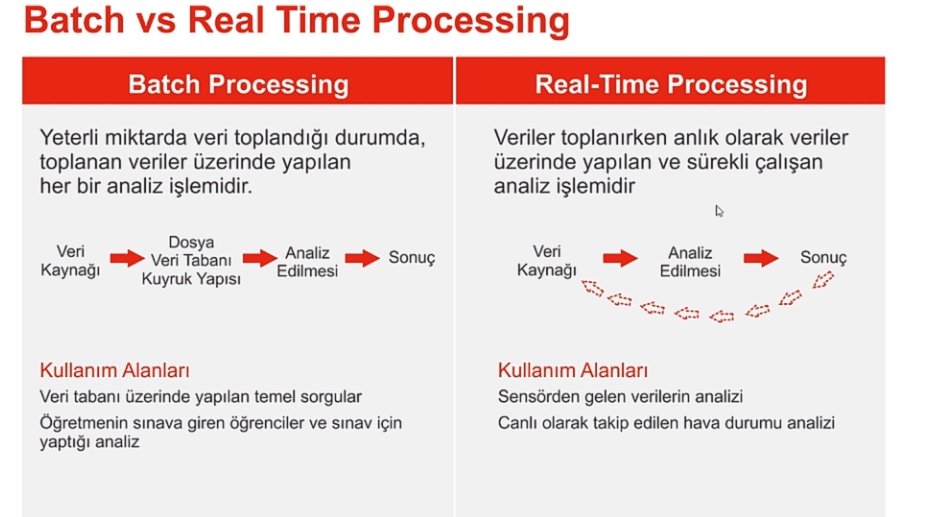
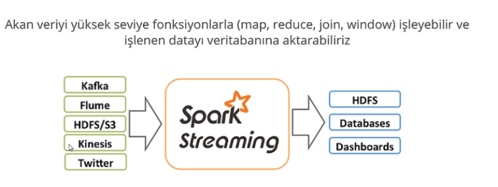
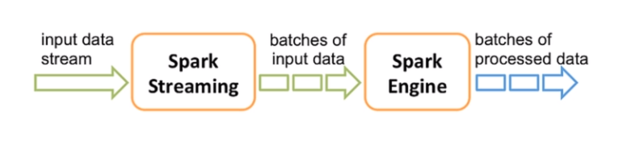
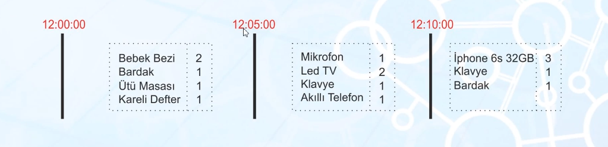
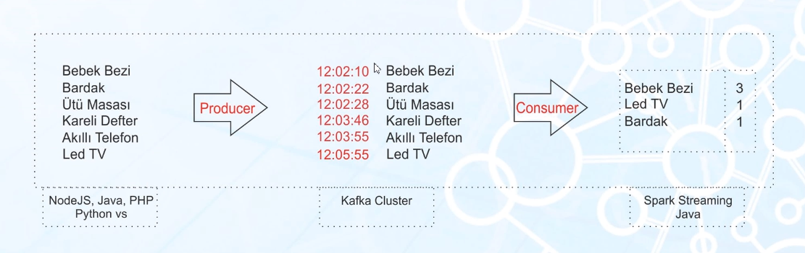

# Big-Data-Notes
Listing my big data notes from [this Udemy Course](https://www.udemy.com/course/sifirdan-her-yonuyle-bigdata/)

## Section 1: Introduction to Big Data

1) If we want to label some data as big data, it has some properties as follows(known as 5V, sometimes 3 V or 11 V is used):

- Volume

- Velocity

- Variety

- Verification

- Value

2) A plane is generally having more than 5000 sensors. 10 GB data is created per second per engine in an airplane.

For a flight between Adana and Istanbul, the flight is taking 1 hour. The data created during this flight is

Data Generation Speed * Number of Engines * Total second of flight

10 GB * 2 engines * 3600 Seconds ~ 72 TB

3) An inforgraphics for social media is below


4) Variety means having different data sources like images, texts, audios, sensors, csvs, database tables etc.

5) Verification is that checking the data. For instance, speed value can't be negative or a probability can't exceed 1 etc.

6) Hadoop and spark are 2 most popular big data technologies. They are based on distributed computing.

7) Hadoop has 2 parts: HDFS and MapReduce. HDFS keeps data in a distributed way. MapReduce is processing data. Develop MapReduce in order to process data 

- Apache Pig
- Apache Hive

8) Spark has no storage part. It works on RAM, which leads to speed increase by 100 times compared to Hadoop.

9) If there are 5 machines in a cluster, 1 machine is master and remaining 4 machines are slaves. Data is replicated in hadoop by a replication factor.


10) Data shouldn't be directly transferrred to Hadoop because it may lose. Kafka should receive data first and then data moves to hadoop secondly.


11) NoSQL is essential in big data technologies because they are scalable. 4 types of NoSQL are as follows:

- Document: MongoDB and ElasticSearch. We can upload a json file to MongoDB.
- Wide Column: Hadoop, HBase, Cassandra
- Key Value: Redis, DynomoDB
- Graph DB: Neo4j, used in social media analysis.


## Hadoop

1) Hadoop is a java library which enables us to make parallel operations of big data(PB, EB) on multiple machines 

2) Hadoop composes of 4 components:

- Hadoop Common: Necessary for Apache Hive & Apache Pig It gives access them to access HDFS.

- HDFS: Hadoop distributed file system

- Hadoop YARN: It manages CPU, RAM and disk usage of MapReduce applications.

- Hadoop MapReduce: Tools to process data which is on HDFS.


3) HDFS can be examplified as follows:


4) MapReduce can be visualized as follows:


5) Hadoop has 3 modes in installation.

- Standalone mode: Used for debugging and testing

- Single Node Cluster: Replication factor = 1. Master and slave are the same.

- Multiple Node Cluster: Replication factor > 1, 1 master and others are slave. Hadoop should be installed in each machine and the network should be configured.

6) Cloudera is a platform in which hadoop, apache pig, apache hive, apache spark are installed. Install vmbox and install cloudera as an operating system.

7) Some hdfs commands on terminal of Hadoop is below:

```
# To create a directory on HDFS
hdfs dfs -mkdir /example

# To transfer a file to HDFS
hdfs dfs -copyFromLocal /path/of/file/in/local /target/directory/on/hdfs

# To see the number of files in a hdfs directory
hdfs dfs -count /example

# To see the content of a file in HDFS
hdfs dfs -cat /example/ratings.csv

# To copy a file in HDFS
hdfs dfs -copy /example/ratings.csv /var

# To delete a file
hdfs dfs -rm /example/ratings.csv

# To move a file to another directory
hdfs dfs -rm /example/ratings.csv /var

# To list files in usr folder
hdfs dfs -ls /us

# To change permissions of a file
hdfs dfs -chmod +x runall.sh

# To set replication factor of HDFS(should be used in a cluster where a master and slaves exist)
hdfs dfs -setrep 4 -R /example/ratings.csv

# Copy file to local
hdfs dfs - copyToLocal /path/in/hdfs /path/in/local

```

8) HDFS is on port 8020. HDFS on local works on 50070.

## Apache Pig

1) Apache is one of the ways to develop Map Reduce in Hadoop. It is processing data in HDFS.

2) We can develop Map Reduce via Java, Python, Scala, Apache Pig and Apache Hive. However, Apache Pig and Apache Hive are preferred.

3) Apache Pig is developed in Pig Latin language.

4) Pig file extension is `.pig`.

5) Some Apache Pig script is below:

```
# Loading data
First = LOAD '/data/*' USING PigStorage(',') AS
(
    userId: int,
    movieId: int,
    rating: double,
    duration: double,
    date: int,
    country: chararray
);

# To print data
DUMP First;

New_Data = FILTER First BY rating>3.0;

DUMP New_Data;

# Drop duplicate rows
New_Data2 = DISTINCT New_Data;

DUMP New_Data2;

New_Data3 = GROUP First BY COUNTRY;

DUMP New_Data3;

AVG_DATA = FOREACH New_Data3 {
    Generate
    group,
    AVG(Data.duration) as ortalama;
}

DUMP AVG_DATA;

-- Inner join
JOINED_DATA = JOIN Personal BY DEPT_ID, DEPARTMENT BY DEPT_ID BY LEFT_TABLE;

DUMP JOINED_DATA;

--Left Join
JOINED_DATA = JOIN Personal BY DEPT_ID LEFT OUTER, DEPARTMENT BY DEPT_ID BY LEFT_TABLE;


-- Saving
STORE JOINED_DATA INTO /path/to/hdfs/directory USING PigStorage(',');

```

6) To run pig script,

```
pig path/to/directory/filename.pig
```

7) Bind condition(?:) is 'if else' of Apache Pig.

a==3?'dogru':'yanlis'

8) We can make regex operations in Apache Pig.

9) Standard Aggregation functions like max, min, avg is possible in Apache Pig.

## Apache Hive

1) Apache Hive is a tool to develop MapReduce on Hadoop environment.

2) We write SQL Queries for Apache Hive.

# MongoDB

1) It is a popular and scalable NoSQL Technology.

2) MongoDB stores data in a format of BinaryJSON, which is similar to JSON.

3) RDBMS vs NoSQL is below:


4) Different terminologies for RDBMS and NoSQL is below:


5) While inserting a new record to mongoDB, a unique id is created as follows:


6) After installing MongoDB, open up a MongoDB Server on Terminal 1 and run command in Terminal 2.

7) To create a DB in MongoDB

```
use DB_NAME_TO_CREATE
```

8) To list DB's in MongoDB(admin is a default DB coming with installition)

```
show dbs
```

9) To show current DB

```
db
```

10) To create collection(Table)

```
db.createCollection("Persons")
```

11) To show collections on DB,

```
show collections
```

12) To insert a document(row) to a collection(table)

```
db.Persons.insert( {ad: "albert einstein"} )
db.Persons.insert( {ad: "madam curie"} )
db.Persons.insert( {ad: "isaac newton"} )
db.Persons.insert( {ad: "celal sengor"} )
```

13) To have a look at the collection

```
db.Persons.find()
```

14) To filter on mongo db

```
db.Persons.find( ad: "isaac newton"} )
```

15) Robomongo(Robo3T) is used in industry instad of CLI we did above. Robo3T is a GUI like pgadmin of postgresql.

16) MongoDB's default port is 27017.

17) We can use MongoDB on Java, Python, C#.

18) Maven is used in Java Enterprise. Maven is a java technology. INstead of adding libraries one by one, we are just adding dependency code to Maven and it will download what is required. We can use Maven to access to mongo db.

19) Java codes are stored under src/main/java in Maven project.

20) pom.xml is our maven config file. We can type what libraries to use under <dependencies> tags

21) All documents(rows) are independent of each other. One document is composed of 50 fields and the other is composed of 3 fields. This makes MongoDB flexible. We don't have to make a relationship of 1 to N, N to N, 1 to 1 etc.

22) We can make CRUD operations on Java for MongoDB.

23) Using MongoDB is more efficient and easier than using Mysql.

# Elastic Search

1) Elastic Search is a NoSQL technology which is used in text search on big data.

2) If search in your main focus, prefer Elastic Search.

3) ES indexes words at saving phase. Therefore, it is faster.

4) A visualization for Elastic Search is below:


5) Terminology for Elastic Search


6) Elastic Search is also having cluster architecture like other big data technologies.


7) Elastic Search keeps its data in JSON format due to the fact that it has a pattern of document based. You can import json file to elastic search directly.

8) POST HTTP verb is more secure in sending credential information like password or credit card info.

9) Elastic Search uses 9200 port

10) To upload a json file to an ES cluster, use PUT HTTP word on Postman and send a Json object (under Body Tab) to `localhost:9200/db_name/table_name/id_of_document` or POST HTTP word and `localhost:9200/db_name/table_name`. We don't have to specify id_of_document in POST HTTP. POST assigns random id to the document.

11) To query an instance in Elastic Search, use GET HTTP word and

```
localhost:9200/db_name/table_name/id_of_document
```

12) To get a selected product, use GET HTTP word

```
localhost:9200/exam/product/126
```

13) To check a document is in ES or not, use GET HTTP word

```
localhost:9200/exam/product/126?_source=false
```

14) To get only selected fields(name and color fields of 126 ID product), use GET HTTP word

```
localhost:9200/exam/product/126?_source_include=name,color
```

15) To delete a document from ES, use DELETE HTTP word

```
localhost:9200/exam/product/126
```

16) To filter only brand=apple, use GET word

```
localhost:9200/exam/product/_search?q=brand:name
```

17) To get all infos on DB,

```
localhost:9200/_all
```

18) What we did above in Postman is used in testing. ES should be integrated into a programming language like Java or Python.

19) ES can be used in Maven project in Java. ES should be addedas dependency under pom.xml

20) Check out ES Java and Python API's

21) Data which is sent to ES must be JSON. We can send data to ES via Java or Python. Sending data to ES is called indexing.

22) ES is composed of 5 shards by default.

# Apache Kafka

1) The critical point in big data projects is to collect data fast without failure.

2) We are sending data from source to Apache Kafka, not directly to analysis tools.

3) Apache Kafka has a message-queue architecture(FIFO: first in first out). It is distributed. It is used in real time projects. It is developed in Scala language.


4) Producer and COnsumer architecture exist in Kafka.


5) Kafka cluster is consisting of many computers. One computer is called broker. In each broker, there may be several topics.


6) Kafka is distributed, which means that it can be replicated by a replication factor(below = 3)


7) In order to run Kafka cluster, run Zookeeper first.

8) Zookeeper manages resource management in distributed server architectures. Zookeeper is dealing with configuration and keeping configuration files.

10) Zookeeper and Kafka versions must be compatible.

11) Zookeeper uses 2181 port. Kafka uses 9092.

12) Producer is a Kafka API which is sending data to Kafka Topic. Consumer is a Kafka API which is taking data from Kafka Topic to send it to Hadoop or Spark.


13) To create a topic in Apache Kafka

```
kafka-topics.bat --create --zookeeper localhost:2181 --replication-factor 1 --partitions 1 --topic TOPIC_NAME_TO_USE
```

14) To list topics in Apache Kafka

```
 kafka-topics.bat --list --zookeeper localhost:2181
```

15) To create a producer API in Apache Kafka

```
kafka-console-producer.bat --broker-list localhost:9092 --topic TOPIC_NAME
```

16) We can crate a producer API in Java or Python and then send it to Kafka. In most cases, Consumer API and Producer API are created in a programming language and then linked.


17) To create a consumer API in Apache Kafka

```
kafka-console-consumer.bat --zookeeper localhost:2181 --topic TOPIC_NAME
```

18) In Java, add kafka dependencies under pom.xml to use in Java

19) Consumers are listening topcs by *subscribe* keyword in Java. Consumer can listen many topics at the same time.

# Apache Spark

1) Spark was developed in Scala language. It is working on RAM, therefore it is faster than hadoop. Spark has no storage unit.


2) Spark vs Hadoop


3) Spark has a Machine Learning library called **MLLib**. Real time data analysis can be made via **Spark Streaming**. We can make big data analysis via **Spark SQL** .


4) The opposite of real time analysis is batch analysis. Batch analysis is made in Hadoop nad Real time analysis is made in Spark.

5) Apache Spark is also having a cluster architecture.


6) Generally, data is stored in hdfs of Hadoop and processed in Spark. Hadoop is advantegous in hdfs and Spark is advantegous in processing.

7) RDD is Resilient Distributed Dataset. RDD is fundamental data structure of Apache Spark.


8) Apache Spark made a big change in version 1.8. It would be a better practice to use Spark > 1.8. Spark was using Dataframe architecture before 1.8 and now using Dataset architecture after 1.8.

9) Add Spark to Maven repository as dependency in pom.xml.

10) RDD methods are important. Some RDD methods are count, first, last etc.

11) We can import data to RDD via local computer, HDFS or zipped files.

12) RDD operations are 2 types: **transformations** and **actions**. Map and filter are examples of **transformations**. Count and first are examples of **actions**; 


13) Map method of RDD creates a new RDD.

14) Map, foreach and Filter are 3 most used methods of RDD.

14) Filter method of RDD filters input RDD data and create a new RDD data.

15) flatmap, mappartitions, distinct, sample, Union, Substract are transformation methods for RDD. They are creating a new RDD after transformations.

16) PairRDD is a transformation method that creates key value pairs.

17) Spark SQL is used more than RDD's.

18) Lazy evaluation is creating RDD until seeing action method. It is a concept asked in interviews. There must be an action method at the end of the code.


19) **collect** is an action method of RDD. It gathrs data from slaves to master.


20) **take** is an action method of RDD. It is like head of Python dataframe.

21) We can save RDD's to csv's or hdfs via **saveastextfile** action method.

22) Converting input to RDD's via model is the critical point of Java code.

23) MongoDB has an apache spark integration. Its name is *mongo spark connector*. Use this library in Java as dependency in pom.xml.

24) We can save the result of our analysis into MongoDB. MongoDB accepts data which is in JSON format.


# Spark SQL

1) Spark SQL is providing us with writing sql alike functions in order to make analysis.

2) In order to use Spark SQL in Java, add it to pom.xml as dependency.

3) Spark Core(RDD's and section above) uses Spark Context; Spark SQL uses Spark Session.

4) Spark Core & Spark SQL are compared in academical articles. After version 2.0, Spark SQL outperforms. Before version 2.0, Spark Core outperforms.

5) Spark SQL is easier than RDD's(Spark Core).

6) We can subset columns of raw data via select method `data.select("col1","col2")`. We can also use group by in Spark SQL.

7) We can read nested Json objects in a json file.

8) We can filter data via **filter** method of Dataset in Spark SQL.

9) Spark is inspired from Hadoop. Therefore, Spark is based on Hadoop Common. We should explicit it briefly.

10) We can write SQL queries in Java for Spark Dataset instead of Object Oriented Methods above.

```
rawdata.createOrReplaceTempView("person");

sparkSession.sql("SELECT * FROM person")
```

11) Tempview disappears if spark session is closed and even if spark cluster is running. Therefore, use createOrReplaceGlobalTempView. It is useful in teams collaborating with each other.

12) Encoder in Spark means converting json file which is read to a model defined in a Java class.

13) We store data in Hadoop HDFS and process it in Spark and then send processed data to Hadoop HDFS. Other possible scenarios: Read from HDFS and writes on NoSQL or read from Kafka and writes on HDFS

# Real Time Streaming

1) Batch Processing vs Real Time Processing



2) Batch processing is making analysis on a stationary data.

3) Following new born babies via sensors, self driving cars, Amazon go, Google Ads are examples of Real time processing.

4) Some Real Time Streaming technologies are below

- Spark Streaming: A sub project of Spark

- Flink: Similar to Spark Streaming. Used a lot before Spark 2.2.

- Apache: Not used a lot now but it is basis of Spark Streaming and Flink.

- Amazon Kinesis: A product of Amazon. It is an enterprise service. No coding. Drap and drop via GUI's.


5) All of above technologies(Spark Streaming, Amazon Kinesis etc.) can be developed via Scala, Python or Java.

6) Spark Streaming is a library running on Spark Engine



7) Spark Streaming splits data into batches and these batches were fed into Spark Engine. Batches of processed data on Spark Engine are final outputs.



8) [Netcat](https://tr.wikipedia.org/wiki/Netcat) is a messaging app whose data can be processed in real time analysis.

9) We can use data by listening a port or reading from hdfs or reading from Apache Kafka etc in order to use in Spark Streaming.

10) IoT sensor data can be processed in Spark Streaming in a real-time manner.

11) Complete mode takes all data and make analysis. Update mode takes only recent data and make analysis.

12) Real time analysis have 2 types:

- Original Stream: Immediately processing data.

- Windowed (Time) Stream: Partitioning data into some time frames and then make analysis.

13) Original data don't have timestamp value and stream adds it.

13) An example of Windowed Stream is below:



# Apache Kafka - Spark Streaming Integration

1) An example of Kafka and Spark Streaming is below:



2) We can produce and send data to Kafka via Python and consume data in Kafka via Java using libraries

3) To convert data into Json in Kafka Producer, use gson package of Google in pom.xml.


